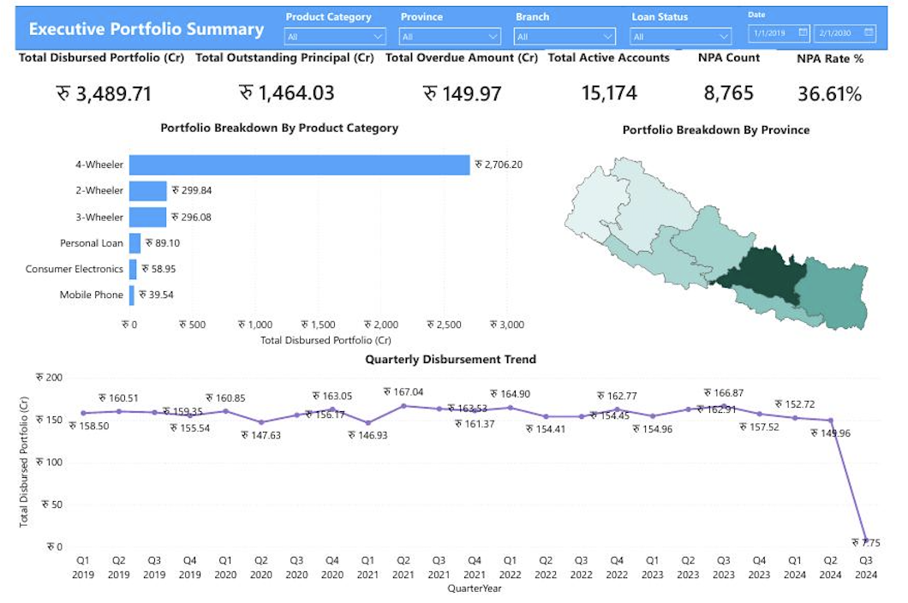
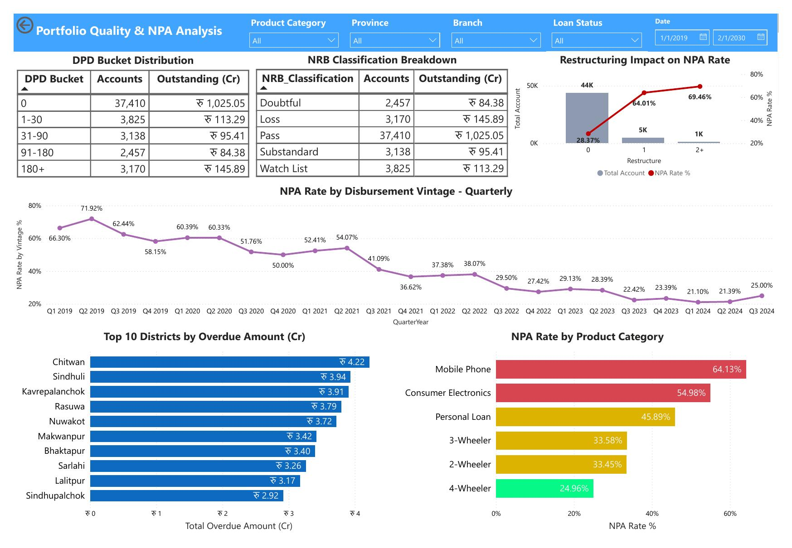
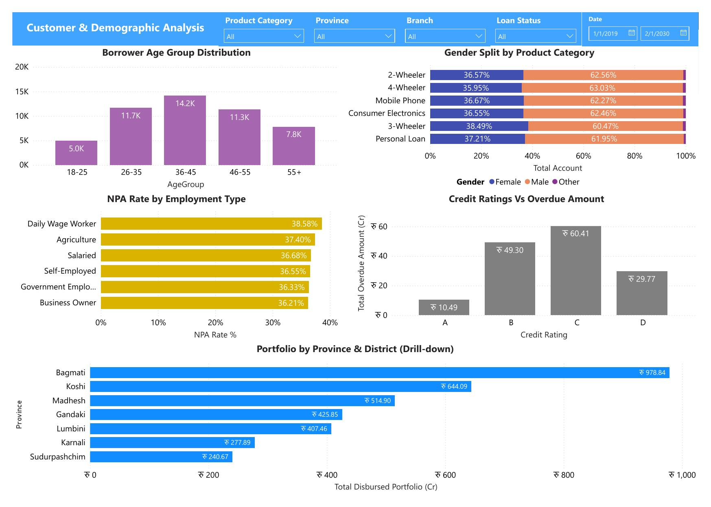
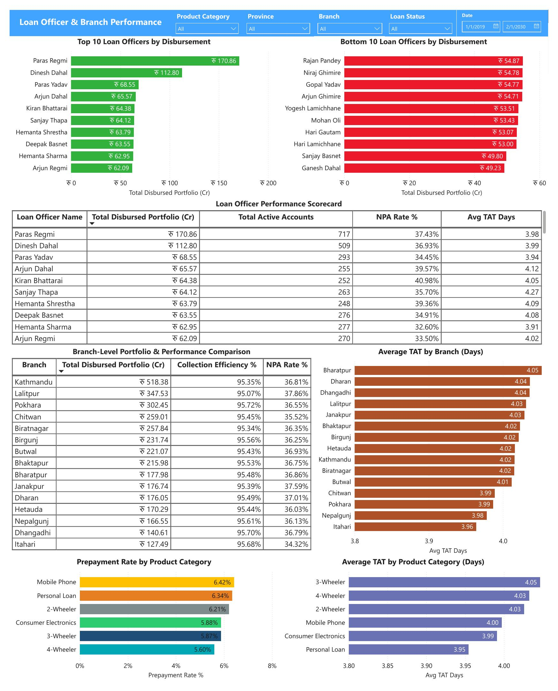
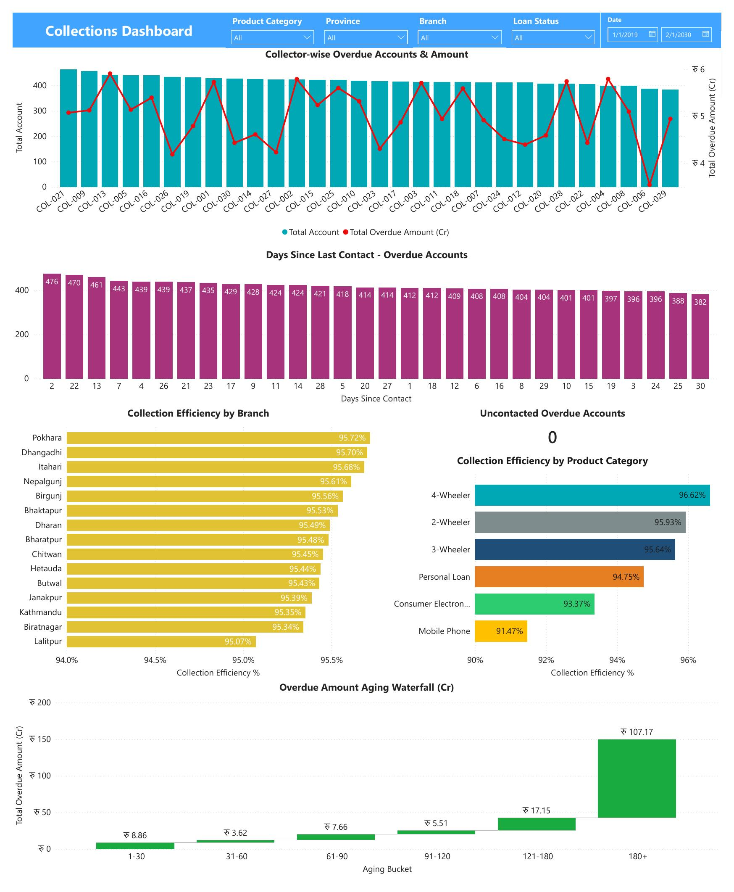

# BHPPL Loan Portfolio Dashboard — Power BI Data Analyst Assessment

A 5-page Power BI dashboard built for **Batas Hire Purchase Private Limited (BHPPL)**, a licensed NBFC regulated by Nepal Rastra Bank, analyzing a 50,000-account hire purchase loan portfolio across 2-Wheeler, 4-Wheeler, 3-Wheeler, Mobile Phone, Consumer Electronics, and Personal Loan products.

## 📁 Repository Contents

| File | Description |
|---|---|
| `BHPPL_Loan_Portfolio_Dashboard.pbix` | Full Power BI report (5 pages, DAX measures, drill-downs, bookmarks) |
| `BHPPL_Dashboard_WriteUp.docx` | 1-page write-up: business questions prioritised, key DAX measures, and a data insight |
| `BHPPL_Dashboard_Screenshots.pdf` | Screenshot PDF of all 5 dashboard pages |
| `screenshots/` | Individual page images (embedded below) |

## 📊 Dashboard Pages

### 1. Executive Portfolio Summary
KPI cards (Total Disbursed, Outstanding, Overdue, Active Accounts, NPA Count, NPA Rate), portfolio breakdown by product category, provincial disbursement shape map, and quarterly disbursement trend (2019–2024). Global slicers synced across all pages.



### 2. Portfolio Quality & NPA Analysis
DPD bucket distribution, NRB classification breakdown (Pass/Watch List/Substandard/Doubtful/Loss), NPA rate by disbursement vintage, product-wise NPA rate comparison, top 10 districts by overdue amount, and restructuring impact on NPA rate.



### 3. Customer & Demographic Analysis
Borrower age group distribution, gender split by product category, NPA rate by employment type, credit rating vs overdue amount, and a Province → District drill-down hierarchy.



### 4. Loan Officer & Branch Performance
Top 10 / Bottom 10 loan officers by disbursement, a full officer performance scorecard, branch-level comparison (portfolio size, collection efficiency, NPA rate), average TAT by branch and product, and prepayment rate by product.



### 5. Collections Dashboard
Collector-wise overdue accounts and amount, days-since-last-contact distribution, an uncontacted overdue accounts check, collection efficiency by branch and product, and an overdue amount aging waterfall (1–30 through 180+ days).



## 🧮 Key DAX Measures

```DAX
NPA Rate % =
DIVIDE([NPA Count], [Total Open Accounts], 0)
// Total Open Accounts = Active + NPA status loans (excludes Closed)

Portfolio at Risk (PAR30) =
DIVIDE(
    CALCULATE(SUM(Loans[Outstanding_Principal_NPR]), Loans[Days_Past_Due] > 30),
    [Total Outstanding Principal], 0
)

Collection Efficiency % =
DIVIDE(SUM(Loans[EMIs_Paid]), SUM(Loans[EMIs_Due]), 0)

Utilisation Rate % =
DIVIDE(SUM(Loans[Disbursed_Amount_NPR]), SUM(Loans[Approved_Limit_NPR]), 0)
```

## 💡 Key Insight

Restructured loans are, in this portfolio, a leading indicator of default rather than a cure. Accounts with zero restructures carry a **28.4% NPA rate**; one restructure raises that to **64.0%**; two or more restructures reach **69.5%** — and notably, 100% of twice-restructured accounts remain open (none have ever closed successfully). See the write-up for the full analysis and two additional findings (a vintage seasoning bias in NPA trends, and a denominator correction to the headline NPA Rate calculation).

## 🛠️ Interactivity Features

- Global slicers (Product Category, Province, Branch, Loan Status, NRB Classification, Gender, Employment Type, Date Range) synced across all pages
- Province → District drill-down hierarchy
- Bookmarked button toggle (Product Category view: Amount vs. Account Count)
- Tooltips with supporting context
- Conditional formatting (red/amber/green) on NPA rate tables and charts

## 📄 About the Assessment

Built as part of a Data Analyst assessment for Batas Hire Purchase Private Limited, based on a synthetic 50,000-record loan portfolio dataset (44 fields) covering loan financials, repayment/DPD status, risk and NRB classification, and operational metrics.
